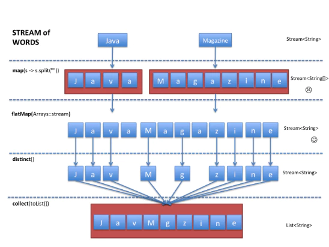

# FP_JS

## Home

https://baram204.github.io/FP_JS/

## Preface

practice for Functional javascript programing book(published by Insight in korea).

I am not capable of dealing with complex if-else statement.  So, I need to replace if-else(etc) hell statement be divided and conquered.

I'm faced of object oriented JS code now. (In that situation) So many complex things happend when (we) implement data manipulation logic, especially find, filter(and etc) data . 

from : [Functional Style List Manipulation: Scala Vs Java 8 Vs Groovy](https://medium.com/beingprofessional/functional-style-list-manipulation-scala-vs-java-8-vs-groovy-89a2b7c99678)

I already know effective way to manage(manipulate) data in safe manner. It's function oriented way. 

from oracle : [Part 2: Processing Data with Java SE 8 Streams](http://www.oracle.com/technetwork/articles/java/architect-streams-pt2-2227132.html)

I know scala's functions as 1st citizen and lambda. but, It's old days and It's not for javascript either. 

So I made this repository for practicing it. as a freelancer, I'm going to read more and less type. My priority is apply FP to part of codes that company assigned to me.

(most funny part is.. company does not direct me todo such things)

In korean

투입된 프로젝트에서 갑자기 자바스크립트를 맡았는데 객체지향으로 작성되어있었습니다. 

자바스크립트에서 객체지향을 구현하기위해서 클로저와 익명함수가 사용되었을 뿐 아니라, 4-5 단계의 깊이를 가진 30~40 여개의 자료 덩어리를 다중 if-else, for 문 등을 사용해서 분기 및 처리하고 있었습니다.

자바를 처음 배운 프로그래머로서, 그 방법이 일견(논리적으로) 타당해 보였지만. 머리가 아팠어요. 논리적이지만 내 머리는 받아들기 힘든 수준의 코드였습니다. (제 지적인 능력의 한계라고 보심 됩니다.)

from : [함수형 스타일 목록 조작 : 스칼라 vs 자바 vs 그루비](https://medium.com/beingprofessional/functional-style-list-manipulation-scala-vs-java-8-vs-groovy-89a2b7c99678)

스칼라로 개발을 했을 때 traverse 가 구현된 객체에 apply() 혹은 find, filter, map 등에 익명함수를 태워보내 데이터를 쉽게 처리한 경험을 해봤기에 자바스크립트에서도 이렇게 하고 싶어졌습니다.

데이터를 하나의 스트림으로 보고 함수를 적용해서 원하는 자료를 가공하거나 추출하는 방식입니다.

from oracle : [2 장: 자바 se 스트림스로 자료 처리하기](http://www.oracle.com/technetwork/articles/java/architect-streams-pt2-2227132.html)

일을 빨리 끝내기 보다는 시키지 않은 일을 하느라 느리게 가는 스타일이고 문제 그 자체를 알아가는데 집학하는 성격이라 이 저장소를 만들고 공부를 시작합니다. 하지만 그래도 프리랜서인 자신의 역할을 자각하기에 책을 읽고 여기에 정리하는 것은 조금만 하려고 합니다.

추신 > 성능상의 이점은 거의 없다고 하네요. 그저 보기가 깔끔해질 뿐. 그것만으로 좋습니다.

## Resources

Library 

- https://gohugo.io
- https://scalafiddle.io
- https://github.com/matcornic/hugo-theme-learn
- http://openexchangerates.github.io/javascript-sandbox-console/

Article & Source codes

- [Lo-Dash Essentials](https://www.amazon.com/gp/product/1784398330/ref=as_li_tl?ie=UTF8&camp=1789&creative=9325&creativeASIN=1784398330&linkCode=as2&tag=colintohblog-20&linkId=4d998cd8f3d986c0a3aef8b8aefe4f4b)
- [Lodash: 10 Javascript Utility Functions That You Should Probably Stop Rewriting](https://colintoh.com/blog/lodash-10-javascript-utility-functions-stop-rewriting)
- https://github.com/you-dont-need/You-Dont-Need-Lodash-Underscore
- https://github.com/indongyoo/functional-javascript
- 
 
Kakaotalk room I stay 

- functional like js : https://open.kakao.com/o/glHwGMH
- freelancerDev : https://open.kakao.com/o/geHO1CL
- dataScience : https://open.kakao.com/o/gZqUuwM